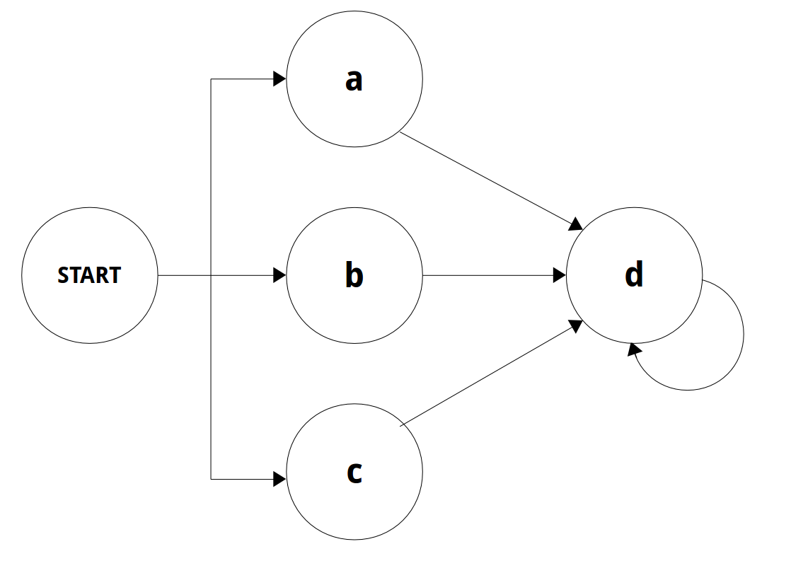

# C Regular Expressions Engine

The way this engine matches regular expressions is by converting the regex into a chain of states which can easily be traversed while moving through the given string.

For example, the regular expression `[abc]d+`, would be interpreted as the following structure:

**Note:** `START` is not a regex anchor, just a starting state for the matching process
